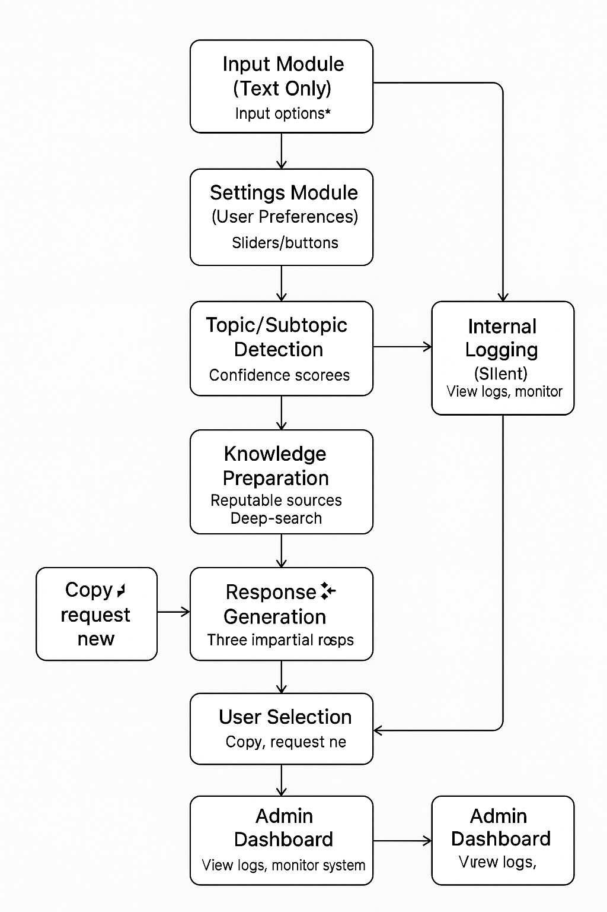

# AI-Powered Content Analysis Program

This application ingests and analyzes user-submitted content (text, URLs, social posts) to produce AI-generated responses or summaries.

---

## Table of Contents
1. [Current Minimal Workflow](#-current-minimal-workflow)
2. [Future-Ready Modular Architecture](#-future-ready-modular-architecture)
3. [Testing Application + Main Application Workflow](#-testing-application-ta--main-application-ma-workflow)
4. [Full Documentation](#-full-documentation)

---

## 🔹 Current Minimal Workflow


---

## 🔹 Future-Ready Modular Architecture



---

## 🔹 Testing Application (TA) + Main Application (MA) Workflow

<details>
<summary>View TA + MA Workflow Diagram</summary>

```mermaid
graph TD

    %% Testing Application
    subgraph TA [Testing Application (TA)]
        A1[Test Orchestration<br><i>Schedules & triggers tests</i>]
        A2[Input Generator<br><i>LLM generates inputs & edge cases</i>]
        A3[Validation Engine<br><i>Rule-based + LLM semantic checks</i>]
        A4[Reporting & History<br><i>Stores results & dashboards</i>]
    end

    %% Main Application
    subgraph MA [Main Application (MA)]
        B1[Input Module<br><i>Django/React UI</i>]
        B2[Processing/Fetcher<br><i>Validates & parses input</i>]
        B3[AI Analysis Module<br><i>CrewAI agents (topic detection, fact check, response gen)</i>]
        B4[Output Module<br><i>Returns JSON + user output</i>]
    end

    %% Flow
    A1 --> A2
    A2 -->|Generates test cases| B1
    B1 --> B2 --> B3 --> B4
    B4 -->|Collects output| A3
    A3 -->|Logs pass/fail + metrics| A4

    %% Optional CI/CD
    subgraph CI [CI/CD Pipeline]
        C1[Deploy Trigger]
    end

    C1 -->|Triggers test run| A1

    %% Classes
    classDef ta fill:#e0f7fa,stroke:#006064,stroke-width:2px;
    classDef ma fill:#fff3e0,stroke:#bf360c,stroke-width:2px;
    class A1,A2,A3,A4 ta;
    class B1,B2,B3,B4 ma;
```
</details>

---

## 🔹 Full Documentation

- [Full Main Application Architecture](docs/ARCHITECTURE.md)
- [Full Testing Application Architecture](docs/TESTING_ARCHITECTURE.md)
