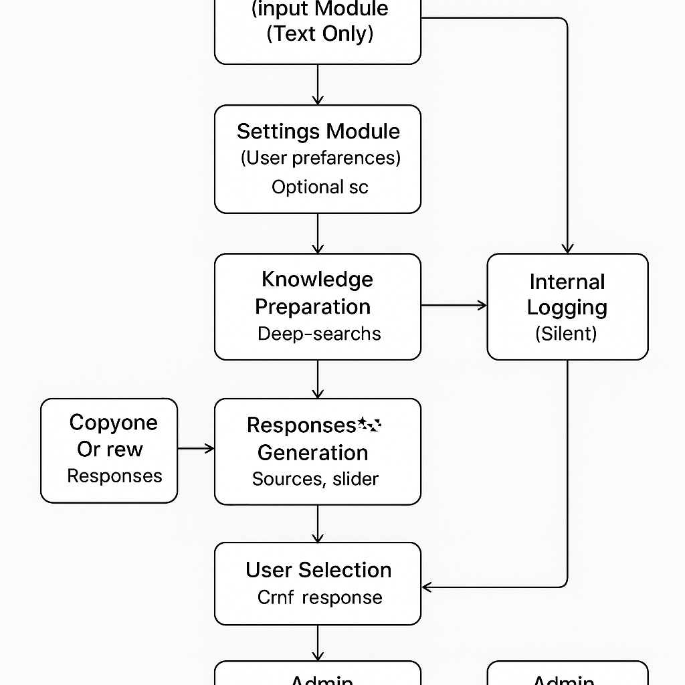

# AI-Powered Content Analysis Program – Architecture Overview

---

## 1. Current Minimal Workflow (Django + CrewAI)

---

## 2. Full Modular Architecture (Future-Ready)

---

## 3. Data Flow Overview

1. Input validation → content fetching → orchestration  
2. AI pipeline: topic detection → knowledge search → response generation  
3. Responses → user output + database logging  

---

## 4. Expansion Roadmap

1. Persistent user profiles and history (OAuth/JWT)
2. Scalable data storage (PostgreSQL, Vector DBs)
3. Multi-LLM support and advanced RAG pipelines
4. Analytics and admin dashboards
5. Multi-source aggregation (Twitter, Reddit, YouTube, etc.)
6. API gateway for external access

---

## 5. Developer Notes

- Diagrams are embedded as PNGs for GitHub.
- **Legend:**  
  - Solid boxes = Current implementation  
  - Dotted boxes = Future expansion  
